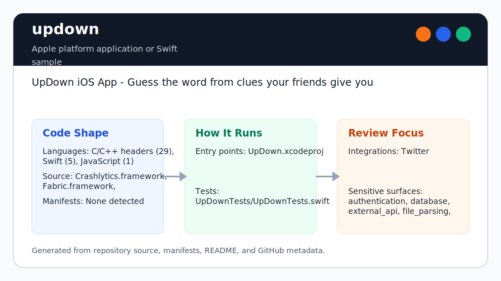
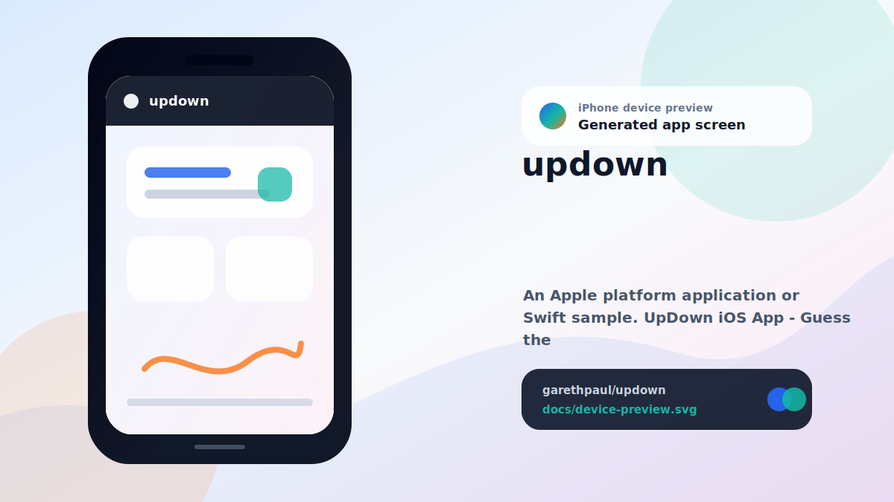

# UpDown

<!-- README-OVERVIEW-IMAGE -->


## Device Preview

<!-- DEVICE-PREVIEW-IMAGE -->


## Overview

UpDown is a small iOS word-guessing game. Hold the phone upright to display a
prompt, give clues to friends, then lower the phone to reset for the next word.
CoreMotion drives the play/stop transition.

The game works fully offline. Its original prompt service now returns HTTP 404,
so prompts are bundled in the app instead of fetched over the network. The
retired MoPub, Fabric, and Crashlytics binary SDKs have also been removed; the
app contains no advertising or analytics integration.

## Supported Toolchain

- Xcode 16
- Swift 5
- iOS 13 or later
- iPhone and iPad simulator/device targets

## Setup

```bash
git clone https://github.com/garethpaul/updown.git
cd updown
open UpDown.xcodeproj
```

Select the shared `UpDown` scheme and run on a simulator or device. A physical
device provides the meaningful CoreMotion experience; simulator tests validate
the build and offline prompt behavior but cannot reproduce real tilting.

## Verification

- `make static` validates the Xcode graph, plists, Interface Builder XML,
  assets, Swift 5/iOS 13 settings, offline prompt contracts, motion lifecycle,
  motion threshold hysteresis, shared scheme, CI, and completed maintenance
  plans.
- `make test` runs the `UpDown` XCTest scheme when `xcodebuild` is available.
- `make build` builds the simulator app without code signing.
- `make check` runs portable contracts, adversarial Make authority tests, and
  the unsigned simulator build everywhere possible, plus real XCTest on macOS.

The local verification boundary assumes the checked-in Makefile is the sole
caller program. Public aliases reject later single-colon recipe replacement,
embed the reviewed root plus literal `PYTHON` and `XCODEBUILD` selections before
later non-override target variables can alter them, and pin `/bin/sh -c` against
later non-override shell assignments. The default Xcode command and iOS helper
tools use absolute system paths. GNU Make `override` directives remain outside
the local trust boundary, as do startup files: startup files are parsed before
repository checks and may execute caller code first. Python executable selection,
including PATH resolution of the default `python3`, is caller-controlled rather
than authenticated by the repository.

GitHub Actions runs the portable full gate on Python 3.10, 3.12, and 3.14 on
Ubuntu 24.04 and runs the full Xcode test scheme on macOS 15. Workflow permissions are
read-only, superseded runs are cancelled, and action revisions are pinned to
immutable commits. Neither checkout step persists the workflow credential.
The workflow invokes `/usr/bin/make`; its checked-in invocation supplies no
additional makefiles or executable overrides.
CodeQL analyzes actions and Python without a build, and analyzes Swift through
an explicit unsigned single-architecture `UpDown` app-target build; XCTest
remains in the canonical macOS Check job.

## Tested Behavior

XCTest verifies deterministic prompt selection, immediate-repeat prevention by
canonical visible prompt value, duplicate weighting, all-identical, single-item, empty,
and blank-source behavior, mixed-source filtering without display rewriting,
out-of-range selector handling, the bundled prompt inventory, motion threshold
hysteresis, active-to-idle reset decisions for unavailable motion samples,
motion-session generation acceptance and invalidation, and foreground/background
motion ownership while the game view remains visible.
Static contracts additionally require motion callbacks to avoid retaining the
view controller, prevent duplicate subscriptions, tolerate small threshold
fluctuations while playing, reset an active prompt after a motion error or
missing attitude, and stop when the view leaves the screen.
Queued callbacks from an ended motion session are ignored before they can
update game state.
Leaving the game view clears any visible prompt and returns the display to idle
after motion callbacks are invalidated and updates stop.
Moving the app out of the active state performs the same invalidation and idle
reset; returning to an active, visible game view starts one fresh session.

## Privacy and Security

- Prompt selection is local and does not contact a server.
- The provider removes blank and whitespace-only prompt values before
  selection while preserving accepted clue text unchanged.
- Immediate-repeat checks collapse whitespace and normalize case, width, and
  canonically equivalent Unicode without changing the displayed clue.
- The app does not contain ad, analytics, or crash-reporting SDKs.
- Motion data is processed in memory only while the game view is visible and
  the application is active.
- No credentials, API keys, or developer-specific build paths are required.

## Limitations

- Motion thresholds still require physical-device verification using the
  checklist below; no completed device run is claimed yet.
- The bundled prompt list is intentionally small and English-only.
- The UI preserves the original single-screen prototype rather than adding
  scoring, categories, accessibility customization, or multiplayer state.

## Physical-Device Motion Checklist

Use an iPhone or iPad running iOS 13 or later. Record the device model, OS
version, app commit, orientation, and result for each step.

1. Start with the device outside magnitude `1.0...2.6`; the idle instruction
   remains visible.
2. Move into `1.0...2.6`; exactly one prompt appears.
3. While playing, fluctuate within `0.9...2.7`, including just outside the
   narrower entry range; the same prompt remains visible.
4. Move outside `0.9...2.7`; the idle instruction returns.
5. Repeat entry and exit several times; each entry consumes one prompt and no
   transition flicker consumes an extra prompt.
6. Interrupt motion availability while a prompt is active; an error or missing
   sample returns the game to idle.
7. Leave the game view while playing; updates stop and play state clears.
   Confirm the idle instruction replaces the visible prompt, a queued callback
   cannot restore it, and one motion subscription resumes after returning.
8. With the game view still visible, background and foreground the app. Confirm
   the prompt resets to idle in the background, no queued callback restores it,
   and exactly one fresh subscription resumes after activation.

This checklist is pending physical-device execution. Simulator and static
results do not satisfy it.

## Repository Guide

- `UpDown` contains the app, offline prompt provider, storyboard, and assets.
- `UpDownTests` contains XCTest coverage for prompt selection.
- `UpDown.xcodeproj` contains the shared build/test scheme.
- `scripts/check_ios_contracts.py` provides portable repository contracts.
- `docs/plans`, `CHANGES.md`, `SECURITY.md`, and `VISION.md` record maintenance
  decisions and project scope.
- `docs/plans/2026-06-10-no-immediate-prompt-repeat.md` records the completed
  prompt repeat-prevention change.
- `docs/plans/2026-06-13-no-immediate-prompt-value-repeat.md` records
  duplicate-value repeat prevention and all-identical fallback coverage.
- `docs/plans/2026-06-13-blank-prompt-filter.md` records fail-closed blank
  prompt filtering and original display-value preservation.
- `docs/plans/2026-06-10-motion-threshold-hysteresis.md` records the completed
  motion boundary stabilization change.
- `docs/plans/2026-06-12-hosted-checkout-credentials.md` records the
  credential-free static and iOS checkout contract.
- `docs/plans/2026-06-12-codeql-manual-swift-build.md` records the explicit
  Swift analysis target and bounded advanced CodeQL workflow.
- `docs/plans/2026-06-14-motion-device-verification-checklist.md` records the
  pending physical-device threshold and lifecycle checklist.
- `docs/plans/2026-06-16-stale-motion-callback-guard.md` records generation
  invalidation for queued callbacks from ended motion sessions.

## Contributing

Preserve the motion-driven game flow, avoid adding hidden data collection, and
run `make check` before opening a pull request. Document physical-device
verification when changing motion thresholds or lifecycle behavior.
